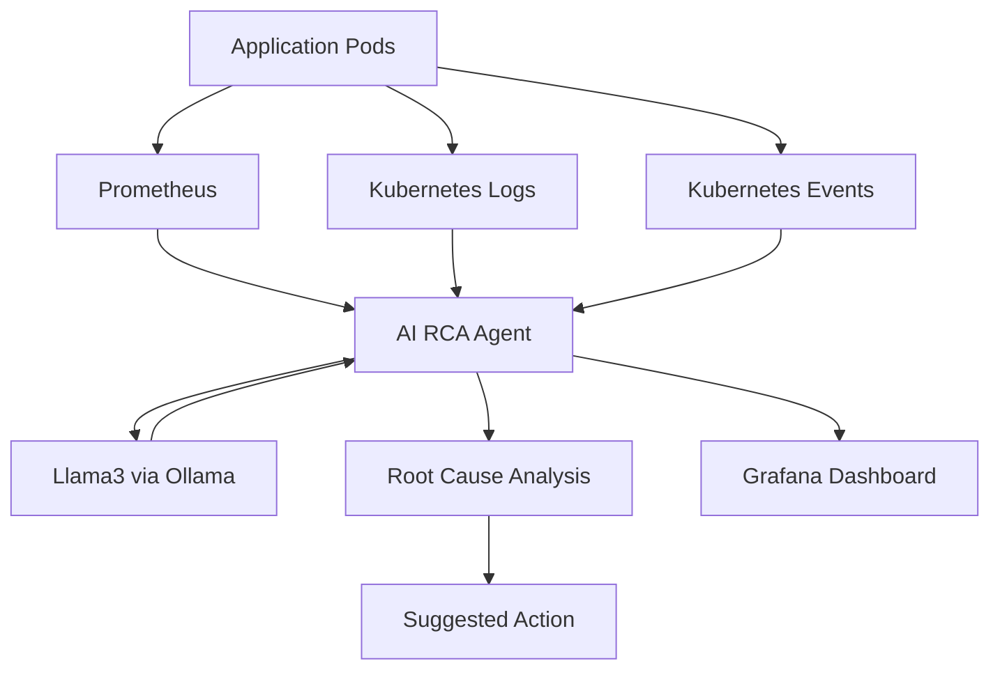

# 🚀 AI Root Cause Analysis Agent for Kubernetes


> 🚀 Part of the **Agentic AI for DevOps** Series

---

# 🎯 Overview

This project demonstrates an **AI-powered Root Cause Analysis (RCA) Agent** running inside Kubernetes.

The agent continuously:

✅ Reads Prometheus metrics
✅ Reads Kubernetes events
✅ Reads application logs
✅ Uses Llama3 (via Ollama) for reasoning
✅ Identifies probable root cause
✅ Suggests remediation steps

---

# 🧠 Problem Statement

In production environments, engineers often need to investigate:

* High latency
* Application crashes
* Database issues
* Network failures
* CPU bottlenecks

Traditional debugging requires manually checking:

❌ Grafana dashboards
❌ Kubernetes events
❌ Pod logs
❌ Metrics

This project automates investigation using AI.

---

# 🚀 Solution

The AI agent acts like an SRE engineer:

1️⃣ Collects telemetry from the cluster
2️⃣ Builds investigation context
3️⃣ Sends context to Llama3
4️⃣ Identifies probable root cause
5️⃣ Suggests corrective action

---

# 🏗 Architecture Diagram



---

# 🔄 Workflow

```text
1. Application starts experiencing issues
2. Prometheus collects metrics
3. Kubernetes stores logs and events
4. AI Agent gathers:
   - Metrics
   - Logs
   - Events
5. Agent builds investigation context
6. Llama3 analyzes telemetry
7. AI identifies probable root cause
8. Suggested remediation is generated
```

---

# 🛠 Tech Stack

| Component                | Purpose                 |
| ------------------------ | ----------------------- |
| Kubernetes               | Container orchestration |
| Python                   | AI controller           |
| Prometheus               | Metrics collection      |
| Grafana                  | Visualization           |
| Ollama                   | Local LLM runtime       |
| Llama3                   | AI reasoning engine     |
| Kubernetes Python Client | Cluster interaction     |

---

# 📁 Project Structure

```bash
root-cause-agent/
│
├── agent.py
├── config.py
├── analyzer.py
├── llm_brain.py
├── prometheus_client.py
├── k8s_logs.py
├── k8s_events.py
│
├── prompts/
│   └── root_cause_prompt.txt
│
├── k8s/
│   ├── app.yaml
│   ├── service.yaml
│   ├── servicemonitor.yaml
│   ├── agent.yaml
│   └── rbac.yaml
│
└── Dockerfile
```

---

# ⚡ Prerequisites

Install:

* Docker
* Minikube
* kubectl
* Helm
* Python 3.10+
* Ollama

---

# 🚀 Setup Instructions

---

# 1️⃣ Start Minikube

```bash
minikube start
```

Verify:

```bash
kubectl get nodes
```

---

# 2️⃣ Install Prometheus + Grafana

---

## Add Helm Repo

```bash
helm repo add prometheus-community https://prometheus-community.github.io/helm-charts

helm repo update
```

---

## Install kube-prometheus-stack

```bash
helm install monitoring prometheus-community/kube-prometheus-stack
```

---

## Verify Pods

```bash
kubectl get pods
```

---

# 3️⃣ Create Namespace

```bash
kubectl create namespace prod
```

---

# 4️⃣ Deploy Fake Application

This app continuously generates database timeout logs for RCA demo.

---

## Apply App

```bash
kubectl apply -f k8s/app.yaml
```

---

# 5️⃣ Create Service

```bash
kubectl apply -f k8s/service.yaml
```

---

# 6️⃣ Create ServiceMonitor

```bash
kubectl apply -f k8s/servicemonitor.yaml
```

---

# 7️⃣ Verify Metrics in Prometheus

---

## Port Forward

```bash
kubectl port-forward svc/monitoring-kube-prometheus-prometheus 9090:9090
```

Open:

👉 [http://localhost:9090](http://localhost:9090)

---

## Test Query

```promql
http_request_duration_seconds_bucket
```

---

# 8️⃣ Install Ollama

Download:

👉 [https://ollama.com](https://ollama.com)

---

## Pull Llama3

```bash
ollama pull llama3
```

---

## Start Ollama Server

```bash
ollama serve
```

---

# 9️⃣ Build AI Agent Docker Image

---

## Use Minikube Docker

```bash
eval $(minikube docker-env)
```

---

## Build Image

```bash
docker build -t root-cause-agent:latest .
```

---

# 🔟 Apply RBAC Permissions

```bash
kubectl apply -f k8s/rbac.yaml
```

---

# 1️⃣1️⃣ Deploy AI Agent

```bash
kubectl apply -f k8s/agent.yaml
```

---

# 1️⃣2️⃣ Verify Pods

```bash
kubectl get pods -n prod
```

---

# 🚀 Run the Demo

---

# 🔥 Generate Load

```bash
kubectl run load -n prod --rm -it --image=curlimages/curl -- sh
```

Inside container:

```bash
while true; do
  for i in $(seq 1 200); do
    curl -s http://latency-app/delay/1 > /dev/null &
  done
  wait
done
```

---

# 📊 Access Grafana

```bash
kubectl port-forward svc/monitoring-grafana 3000:80
```

Open:

👉 [http://localhost:3000](http://localhost:3000)

Login:

```text
admin / prom-operator
```

---

# 📈 Grafana Queries

---

# 🔹 P95 Latency

```promql
histogram_quantile(
  0.95,
  sum(rate(http_request_duration_seconds_bucket{namespace="prod", pod=~"latency-app-.*"}[1m])) by (le)
)
```

---

# 🔹 Running Pod Count

```promql
count(kube_pod_status_phase{
  namespace="prod",
  phase="Running",
  pod=~"latency-app-.*"
})
```

---

# 🤖 AI Agent Output

Check logs:

```bash
kubectl logs -f deployment/root-cause-agent -n prod
```

---

# 🎯 Example Output

```text
🧠 AI ROOT CAUSE ANALYSIS

ROOT_CAUSE: Database bottleneck

SUGGESTED_ACTION:
Check PostgreSQL connectivity or increase connection pool size
```

---

# 🧪 Demo Scenarios

| Scenario        | Expected RCA        |
| --------------- | ------------------- |
| DB timeout logs | Database bottleneck |
| High CPU usage  | CPU bottleneck      |
| Probe failures  | Bad deployment      |
| OOMKilled pods  | Memory pressure     |

---

# 🧠 Key Learning

* Metrics alone are not enough
* Logs provide deeper context
* AI reasoning improves incident investigation
* Observability + AI = Autonomous SRE systems

---

# 🔐 RBAC Permissions

The AI agent requires access to:

* Pods
* Pod logs
* Events

RBAC is configured in:

```text
k8s/rbac.yaml
```

---

# 🚀 Future Enhancements

* Auto-remediation
* Slack alerts
* Multi-agent collaboration
* Incident memory
* Vector database integration
* Deployment rollback
* Multi-cluster support

---

# 🎥 Recommended Demo Flow

```text
Healthy System
    ↓
Inject DB Timeout Logs
    ↓
Latency Increases
    ↓
AI Investigates
    ↓
Root Cause Detected
    ↓
Suggested Action
```

---

# ⭐ Support

If you found this useful:

⭐ Star the repository
🔔 Subscribe on YouTube
💬 Share feedback

---

# 👨‍💻 Author

DevOps Engineer building AI-powered Kubernetes automation systems.

---

# 📜 License

MIT License
